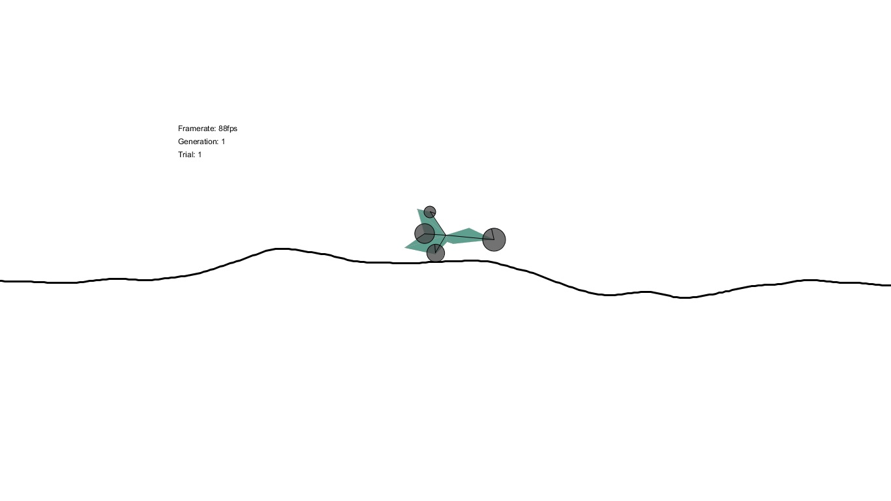
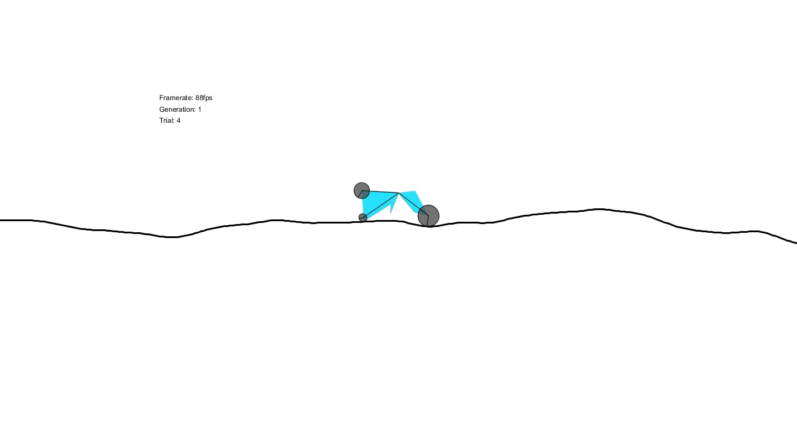
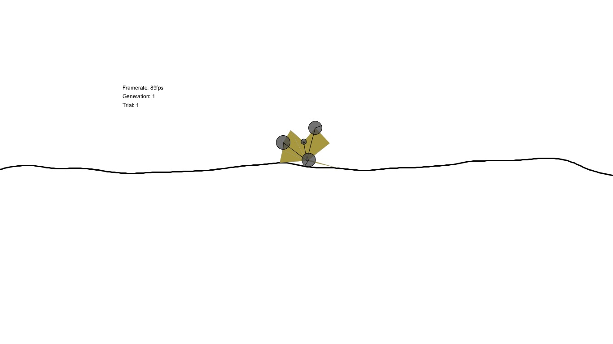
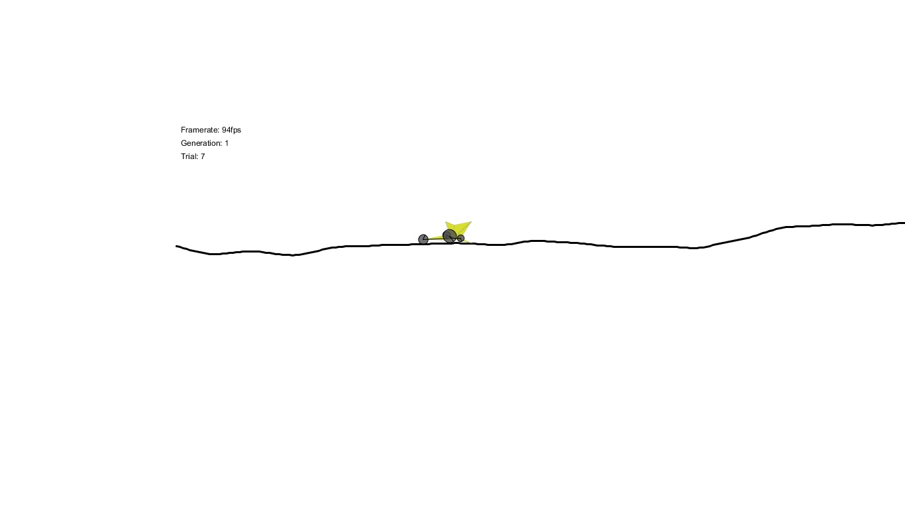

# Genetic Algorithms

## BoxCar2D

This is a computational intelligence car evolution project, a replica of [BoxCar2D](http://www.boxcar2d.com/) made entirely in Processing and a Java wrapper by Daniel Shiffman for the Box2D physics engine.

### How cars are built
Each car consists of one central vertex and eight other vertices at random distances from the central vertex. Each triangle so formed is  initialized as a separate Box2D body to allow concave polygons. Each vertex has a 60% probability of spawning a wheel. The radius of the wheel is also selected at random. Wheels are built from the CircleShape class of Box2D and have a density and friction of 1 and a coefficient of restitution of 0.5

### The DNA sequence
The DNA consists of 36 values between 0 and 1. Let's divide the DNA array into sequences of 4 elements. These four elements together make up the properties of a vertex. The first 32 elements thus encode the genetic information for the eight vertices. The last four elements decide the color (R, G, B, A values). The first two elements of a vertex encode the magnitude and direction of the position vector relative to the fixed origin. The third element decides whether the vertex gets a wheel. The fourth element decides the radius of the wheel if any.

### How surfaces are built
The surface (or the track) is built using the ChainShape class in Box2D. The vertices for the chain shape are generated procedurally using Perlin Noise. The surface is the same for all genomes of a population to maintain even difficulty for all genomes. It is changed after every population though. As the track progresses, the offset of the perlin noise function is changed due to which, the later parts of the track becomes more bumpy and difficult to maneuvre.

### Algorithm
Each car has a DNA sequence which is optimized over using a Genetic Algorithm. Each generation has 20 genomes. The fitness is calculated by distance of travel. Fitnesses are mapped to the DNA and these DNA arrays are selected according to their weights and a mating-pool is generated. Two random elements from the mating pool are selected. Care is taken to prevent both genomes being identical. There is a choice between split recombination and uniform recombination. By default, the DNA is split into two parts only.

### Appendix
Clicking discards the current genome. This can be useful to manually set up the first generation. If the first generation is manually set up, the algorithm will converge sooner.
If a car is stationary for 300 frames, it will be discarded automatically.

## Smart Rockets

This program demonstrates how a population of `rockets` can be taught to meander around an obstacle using genetic algorithms. Is it deployed [here](https://smart-rockets.firebaseapp.com/)

### How rockets are built
Each rocket consists of an origin vertex, where all the forces are applied. An arrow-like shape is drawn around this origin, to resemble a rocket.

### The DNA sequence
Each rocket lives for 400 frames and hence the DNA consists of 400 vectors, one for each frame. The corresponding vector is applied as a force to the rocket at each frame.

### Algorithm
The DNA sequences thus obtained are subjected to optimization using a genetic algorithm in order to create an array of vectors (the physics vectors) that would lead the rocket to the target circle at the top of the screen.

## Steering Behaviors

This program is a variation of the Smart Rockets example where the rockets are left in an [agar.io](www.agar.io) like environment where each rocket tries to survive by eating green pellets (+health) and avoiding the red ones (-health). Health decreases every frame by a small amount. The rocket with the perfect balance of speed, visibility range and steer torque survives the longest. It is deployed [here](https://steering-behaviors.firebaseapp.com/)

### How rockets are built
Each rocket consists of an origin vertex, where all the forces are applied. An arrow-like shape is drawn around this origin, to resemble a rocket.

### The DNA sequence
Each DNA sequence consists of four elements. The first element encodes the affinity of the rocket towards the food (green particles), the second element encodes the affinity towards the poison (red particles), the third and fourth elements encode the visibility ranges for food and poison respectively.

### Movement mechanism
The movement of the rockets is based on Craig Reynolds' work on steering behaviors. Specifically, the rockets use the `seek` behavior to reach a target, where the direction of motion is a fraction of the actual required direction vector. This allows for more smooth and natural-looking movement.

### Algorithm
The DNA sequences obtained are subjected to optimization using a genetic algorithm in order to find the set of parameters that enable a particular rocket to survive the longest. The genetic algorithm in this example is an example of mitosis, ie, recombination doesn't require two parents, instead, if an individual survives for long, it generated two copies of itself, one with a mutation rate of 1% and another with a mutation rate of 50%. This helps prevent convergence into local optima.

