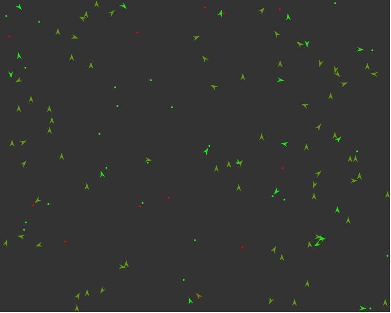
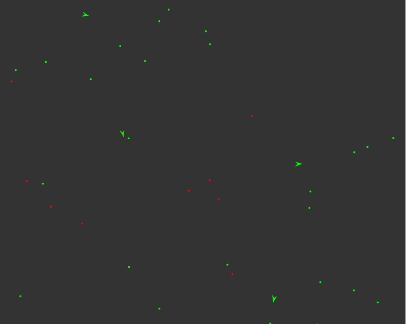

# Steering Behaviors
---
This program is a variation of the Smart Rockets example where the rockets are left in an [agar.io](www.agar.io) like environment where each rocket tries to survive by eating green pellets (+health) and avoiding the red ones (-health). Health decreases every frame by a small amount. The rocket with the perfect balance of speed, visibility range and steer torque survives the longest. It is deployed [here](https://steering-behaviors.firebaseapp.com/)

### How rockets are built
Each rocket consists of an origin vertex, where all the forces are applied. An arrow-like shape is drawn around this origin, to resemble a rocket.

### The DNA sequence
Each DNA sequence consists of four elements. The first element encodes the affinity of the rocket towards the food (green particles), the second element encodes the affinity towards the poison (red particles), the third and fourth elements encode the visibility ranges for food and poison respectively.

### Movement mechanism
The movement of the rockets is based on Craig Reynolds' work on steering behaviors. Specifically, the rockets use the `seek` behavior to reach a target, where the direction of motion is a fraction of the actual required direction vector. This allows for more smooth and natural-looking movement.

### Algorithm
The DNA sequences obtained are subjected to optimization using a genetic algorithm in order to find the set of parameters that enable a particular rocket to survive the longest. The genetic algorithm in this example is an example of mitosis, ie, recombination doesn't require two parents, instead, if an individual survives for long, it generated two copies of itself, one with a mutation rate of 1% and another with a mutation rate of 50%. This helps prevent convergence into local optima.

